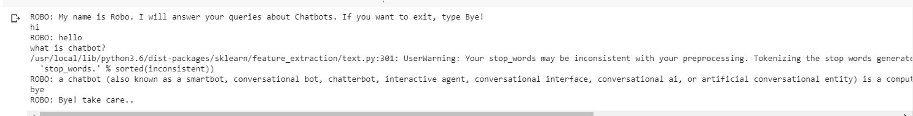

# Chatbot
A chatbot (also known as a smartbot, conversational bot, chatterbot, interactive agent, conversational interface, Conversational AI, or artificial conversational entity) is a computer program or an artificial intelligence which conducts a conversation via auditory or textual methods.

## How do Chatbots work?

<b>There are broadly two variants of chatbots: Rule-Based and Self learning.</b> 

<b>In a Rule-based approach</b>, a bot answers questions based on some rules on which it is trained on. The rules defined can be very simple to very complex. The bots can handle simple queries but fail to manage complex ones. 
The Self learning bots are the ones that use some Machine Learning-based approaches and are definitely more efficient than rule-based bots. These bots can be of further two types: Retrieval Based or Generative. 
i) <b>In retrieval-based models</b>, a chatbot uses some heuristic to select a response from a library of predefined responses. The chatbot uses the message and context of conversation for selecting the best response from a predefined list of bot messages. The context can include a current position in the dialog tree, all previous messages in the conversation, previously saved variables (e.g. username). Heuristics for selecting a response can be engineered in many different ways, from rule-based if-else conditional logic to machine learning classifiers. 

ii)<b> In Generative bots </b>can generate the answers and not always replies with one of the answers from a set of answers. This makes them more intelligent as they take word by word from the query and generates the answers. 

  

# Downloading and installing NLTK

## Install NLTK: run pip install nltk
Test installation: run python then type import nltk
For platform-specific instructions, read here.

## Installing NLTK Packages
import NLTK and run nltk.download().This will open the NLTK downloader from where you can choose the corpora and models to download. You can also download all packages at once.

## Text Pre- Processing with NLTK
The main issue with text data is that it is all in text format (strings). However, the Machine learning algorithms need some sort of numerical feature vector in order to perform the task. So before we start with any NLP project we need to pre-process it to make it ideal for working. Basic text pre-processing includes:

Converting the entire text into uppercase or lowercase, so that the algorithm does not treat the same words in different cases as different

## Tokenization: 
Tokenization is just the term used to describe the process of converting the normal text strings into a list of tokens i.e words that we actually want. Sentence tokenizer can be used to find the list of sentences and Word tokenizer can be used to find the list of words in strings.
The NLTK data package includes a pre-trained Punkt tokenizer for English.

Removing Noise i.e everything that isn’t in a standard number or letter.
Removing Stop words. Sometimes, some extremely common words which would appear to be of little value in helping select documents matching a user need are excluded from the vocabulary entirely. These words are called stop words

## Stemming: 
Stemming is the process of reducing inflected (or sometimes derived) words to their stem, base or root form — generally a written word form. Example if we were to stem the following words: “Stems”, “Stemming”, “Stemmed”, “and Stemtization”, the result would be a single word “stem”.

## Lemmatization: 
A slight variant of stemming is lemmatization. The major difference between these is, that, stemming can often create non-existent words, whereas lemmas are actual words. So, your root stem, meaning the word you end up with, is not something you can just look up in a dictionary, but you can look up a lemma. Examples of Lemmatization are that “run” is a base form for words like “running” or “ran” or that the word “better” and “good” are in the same lemma so they are considered the same.

## Output:

  

