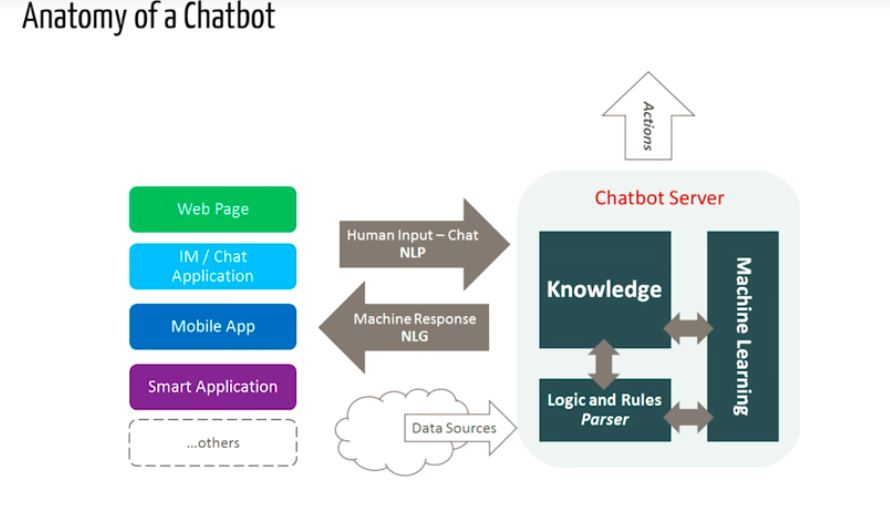

# Chatbot
A chatbot (also known as a smartbot, conversational bot, chatterbot, interactive agent, conversational interface, Conversational AI, or artificial conversational entity) is a computer program or an artificial intelligence which conducts a conversation via auditory or textual methods.

## How do Chatbots work?
<b>There are broadly two variants of chatbots: Rule-Based and Self learning.</b> 

<b>In a Rule-based approach</b>, a bot answers questions based on some rules on which it is trained on. The rules defined can be very simple to very complex. The bots can handle simple queries but fail to manage complex ones. 
The Self learning bots are the ones that use some Machine Learning-based approaches and are definitely more efficient than rule-based bots. These bots can be of further two types: Retrieval Based or Generative. 
i) <b>In retrieval-based models</b>, a chatbot uses some heuristic to select a response from a library of predefined responses. The chatbot uses the message and context of conversation for selecting the best response from a predefined list of bot messages. The context can include a current position in the dialog tree, all previous messages in the conversation, previously saved variables (e.g. username). Heuristics for selecting a response can be engineered in many different ways, from rule-based if-else conditional logic to machine learning classifiers. 

ii)<b> In Generative bots </b>can generate the answers and not always replies with one of the answers from a set of answers. This makes them more intelligent as they take word by word from the query and generates the answers.   

   

# Downloading and installing NLTK

## Install NLTK: run pip install nltk
Test installation: run python then type import nltk
For platform-specific instructions, read here.

## Installing NLTK Packages
import NLTK and run nltk.download().This will open the NLTK downloader from where you can choose the corpora and models to download. You can also download all packages at once.
